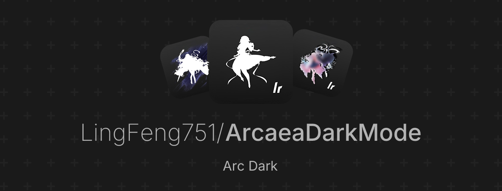

# This package is a free product. If you have paid for it, please request a refund immediately, leave a negative review and report it!!! 

[简中(Simplified Chinese)](README.md) | [繁中(Traditional Chinese)](README_zh-Hant.md) | **[EN](README_en-US.md)**

## ArcaeaDarkMode Project Introduction
* Dark mode for Arcaea, to facilitate playing Arcaea at night and reduce visual fatigue.   
* <mark><ins>**Attention, Android players! This is the China-exclusive version of Arcaea, not the Google Play version, but the game data of the two are interconnected.**</mark></ins>

## Applicable Users
* Those troubled by astigmatism or other vision problems and unable to clearly see the light side of the screen
* Those who enjoy playing in the dark but find the main interface and the light side of the screen too bright and dazzling
* Those who are frustrated by the poor readability of the light side of the screen when trying to achieve high scores 

## Author
[Bilibili@醬香水蜜桃](https://space.bilibili.com/1731112026) 

## Please support the official original version
[Arcaea - New Dimension Rhythm Game](https://arcaea.lowiro.com/) 

## Supported Environments (The following iOS includes iPadOS)
* iOS 12.4+ (Connected to PC or macOS)
* iOS 14.0~17.0[View Supported iOS Versions](Trollstore_Support_Version.md) (Using [Trollstore](https://trollstore.org/))
* iOS 12.4+ ([Jailbroken](https://bing.com/search?q=how+to+jailbreak+iphone) devices with the [AFC2 and APPsync](https://www.3u.com/tutorial/articles/how-to-install-appsync-afc2-service) patches installed)
* Android <mark><ins>**(This is the China-exclusive version of Arcaea, not the Google Play version, but the game data of the two are interconnected.)**</mark></ins>

## Download Methods
* Get it from [Releases](https://github.com/LingFeng751/ArcaeaDarkMode/releases)
* Get it from [123 Pan](https://www.123684.com/s/HOGzTd-lY27H) (1GB download per account per day with no speed limit)
* Get it from [Backup Link of 123 Pan](https://www.123684.com/s/HOGzTd-7Y27H) (1GB download per account per day with no speed limit)
* Get it from [Baidu Netdisk](https://pan.baidu.com/s/1BI6dKJd5P8EG7FsV6eh_rA?pwd=1145) (Extraction code: `1145`, <mark><ins>**Not recommended for non-SVIP users**</mark></ins>) 

## Usage Method (Android)
Choose a suitable download method from the download methods mentioned above, and install it directly after downloading. 

## Usage Method (Apple | iOS, iPadOS)
* [[Bilibili] Installation Tutorial for iOS Platform](https://www.bilibili.com/video/BV1VrQtYgEQg/)
* [[Bilibili] Fragments Modification Tutorial for iOS Platform](https://www.bilibili.com/video/BV1TCV1zZEYc/)
* [[Bilibili] Version Update Tutorial for iOS Platform and Solutions for Unavailable Versions](https://www.bilibili.com/video/BV1sTe8zfEM7/) 

## Which one should I choose from the Assets in Releases?
| Filename | introduction |
|:------|:------|
| `iOS.ArcDark.[Version Number].ipa.zip` | This is the iOS version of the Arcaea dark theme integration package, including the ipa and background images. It can be installed alongside the official version of Arcaea and supports over-the-air updates. <mark><ins>**Please refer to the [tutorial](https://www.bilibili.com/video/BV1VrQtYgEQg/) for installation instructions.**</mark></ins> |
| `Android.ArcDark.[Version Number]c.apk` | This is the Android <mark><ins>**China version**</mark></ins> of the Arcaea dark theme package. It can be installed alongside the official version of Arcaea and can be directly installed after downloading. It supports over-the-air updates. |
| `iOS.Arcaea.[Version Number].Original.ipa` | This is the original iOS jailbreak installation package without any modifications. After installation, it is the same as the version on the App Store (in-app purchases cannot be used). <mark><ins>**If you don't want to modify the background images yourself, this is not the version you should download.**</mark></ins> |
| **Beta Version** |  |
| `Android.ArcDark.[Version Number]c.BetaX.apk` | Android <mark><ins>**China version**</mark></ins> of Arcaea <mark><ins>**beta version**</mark></ins> dark mod package, <mark><ins>**contains untested modifications that will usually be released in the next version**</mark></ins>, can be installed alongside the official version of Arcaea, can be directly installed after download, supports overwrite update (will overwrite the official version) |
| `iOS.ArcDark.[Version Number].BetaX.ipa.zip` | iOS version of Arcaea <mark><ins>**beta version**</mark></ins> dark mod integrated package, <mark><ins>**contains untested modifications that will usually be released in the next version**</mark></ins>, includes ipa and background images, can be installed alongside the official version of Arcaea, supports overwrite update (will overwrite the official version), <mark><ins>**installation method needs to refer to [tutorial](https://www.bilibili.com/video/BV1VrQtYgEQg/)**</mark></ins> |

## Notes
1. This project is generally updated around 13:00(GMT+8) on the day of the official update release.
2. This project is for the author's personal use and is shared only for that purpose. There is no form of profit involved.
3. If you choose to use the ArcDark mod package, please use it quietly and without showing off your scores with screenshots. Otherwise, you may be severely criticized. If the impact is too great, it may even lead to the suspension of your account!!!
